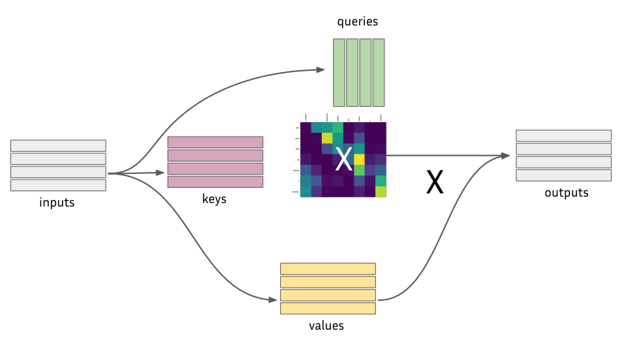
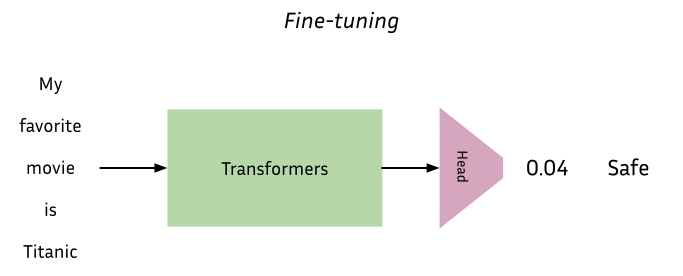

# **Course 1: Introduction & Recap**


---
<!--_class: lead -->
# Welcome to the Advanced NLP course!

---
<!--footer: 'Course 1: Introduction & Recap' -->

### NLP in recent years

<center></center>

---

### NLP in 2024
<br/>

<center>

</center>

---

### NLP in 2024

<center>

</center>

---

### NLP in 2024
> *A picture of the computer science school EPITA, with the school logo on a banner.*

<center>

</center>

---

### NLP in 2024
<center>

</center>


---

### NLP in 2024

<center>

</center>

---

### NLP perspectives

<center>

</center>

---
<!--_class: lead -->
# So, is NLP solved? <h6>(No.)</h6>

---


### NLP challenges

<center>

</center>

---
### NLP challenges
<br>

<center>

</center>

---
### NLP challenges

<center>

</center>

---
### Course organization
<br>
<br>

<div style="display: flex;">
    <div style="flex: 33%;">
        <center>
        </br>
        Matthieu <br/>Futeral-Peter <small>(mail:futeral)</small></center>
    </div>
    <div style="flex: 33%;">
        <center>
        </br>
        Nathan <br/>Godey</center>
    </div>
    <div style="flex: 33%;">
        <center>
        </br>
        Francis <br/>Kulumba</center>
    </div>
</div>

<center><pre>firstname.name@inria.fr</pre></center>

---
### Course organization

* Part 1
    * ***When :*** 4 days (30/11, 07/12, 14/12, 21/12)
    * ***Subject :*** General NLP
    * ***Goal :*** Know how to build and deploy a custom ChatGPT-like assistant.

---
### Evaluation
* Group project (4-5 people)
* Two options
    * *Demo*
    * *R&D project*

---
### Evaluation - Demo (option 1)

Use a well-known approach to produce a MVP for an <ins>original</ins> use-case and present it in a demo. 

*Example: An online platform that detects AI-generated text.*<br>

---
### Evaluation - R&D project (option 2)

Based on a research article, conduct original experiments and produce a report. 


*Example: Do we need Next Sentence Prediction in BERT? (Answer: No)*

---
### Evaluation
* Mid-term project evaluation (30%)
    * Project proposal
    * First elements
    * ~January
* Final project (70%)
    * Short report showing each person's contribution
    * Github repo

---
### Evaluation
* You can already constitute teams
* Send an email with:
    * Names of team members
    * cc to everyone in the team
    * *Demo* or *R&D*
    * One-sentence description of project
* If you really have no idea what to do, <ins>ask me</ins>

---
### Program
* **Session 1 (Today)**: Recap
* **Session 2 (7/12)**: Tokenization
* **Session 3 (14/12)**: Language Modeling
* **Session 4 (21/12)**: Modern NLP with limited resources

---
<!--_class: lead -->
# Questions

---
<!--_class: lead -->
# Recap

---
<!--_class: lead -->
# Quiz time!
https://docs.google.com/forms/d/1BZaBagWlpVgKLsT2NdjJ4pXzPXTBnsxv52jEF4CR6GY/prefill

---
<!--_class: lead -->
# Basic concepts in NLP

---
### Stemming / Lemmatization

**Stemming** shortens variations (*inflected forms*) of a word to an identifiable root

Example: 
*Flying using airplanes harms the environment*
=>
*Fly us airplane harm the environ*

---
### Stemming / Lemmatization

**Lemmatization** <ins>groups</ins> variations (*inflected forms*) of a word to an identifiable representative word

Example: 
*Flying using airplanes harms the environment*
=>
<i>Fly us<b>e</b> airplane harm the environ<b>ment</b> </i>

---
### Tokenization

**Tokenization** turns text strings (= lists of characters) into lists of meaningful units (e.g. words or subwords)

Example: 
*Flying using airplanes harms the environment*
=>
*( Fly | ing | us | ing | air | planes | harms | the | environ | ment )*

(see Course 2)

---
### Regular expressions

**Regular expressions** is a string that specifies a match pattern in text

Example: 
`/\w*ing\b/` -> *Flying using airplanes harms the environment*
\=
Two matches:
- *Flying*
- *using*

---
### Zipf's law

<center></center>

---
<!--_class: lead -->
# Machine Learning \& NLP

---
### Embeddings

- Vectors that represent textual entities (words, sentences, documents, ...)

<center></center>

---
### Bag-of-Words Embeddings

Represent a sentence/document by counting words in it.

Example:
*John likes to watch movies. Mary likes movies too.*
=>
```
{John: 1, likes: 2, to: 1, watch: 1, movies: 2, Mary: 1, too: 1}
```
=>
`[1, 2, 1, 1, 2, 1, 1]`

---
### TF-IDF Embeddings

Represent a sentence/document by comparing how frequent a word is in the extract vs. how frequent the word is in general.
<br>
<center></center>

---
### Skip-gram \& CBoW

Learn embeddings **without supervision/counting**.
<br>
<center></center>

---
### Static word embeddings

Allow semantically meaningful spaces and can be used as features.
<br>

<div>
    
    <p>
    Known static embeddings include:
    <ul>
    <li> GloVe
    <li> FastText
    <li> Word2Vec
    <li> ...
    </ul>
</div>

---
<!--_class: lead -->
# Deep Learning \& NLP

---
### RNNs

**Recurrent Neural Networks**
Neural Networks that are able to process input sequences recurrently.
<center></center>

---
### Transformers
Neural Networks that are able to process input sequences <ins>directly</ins>.
<center></center>

---
### Transformers - Self-Attention
Self-attention allows comparing inputs and representing interactions.
<center></center>

---
### Fine-tuning
Modern NLP models are built in two separate steps:
- **Pretraining**: models are trained **without supervision** on raw text data (e.g.: next word prediction on all text from Wikipedia).
- **Fine-tuning**: pretrained models are *re*trained on a smaller annotated dataset that matches the final task.

---
### Fine-tuning - example

1. Download a Transformers language model that was pretrained on data from the Internet (books, Wikipedia, ...) to predict future words

2. Take a list of tweets and mark them as *suspicious* or *safe*

3. Add a classifier on top of the LM that predicts a float in [0, 1]

4. Train the whole model (LM + classifier) to predict *suspicious* or *safe* tweets

---
### Fine-tuning - example
<br>
<center></center>

---
### Fine-tuning - example
<br>
<center></center>

---
<!--_class: lead -->

# Questions?


---
<!--_class: lead -->
# Lab session