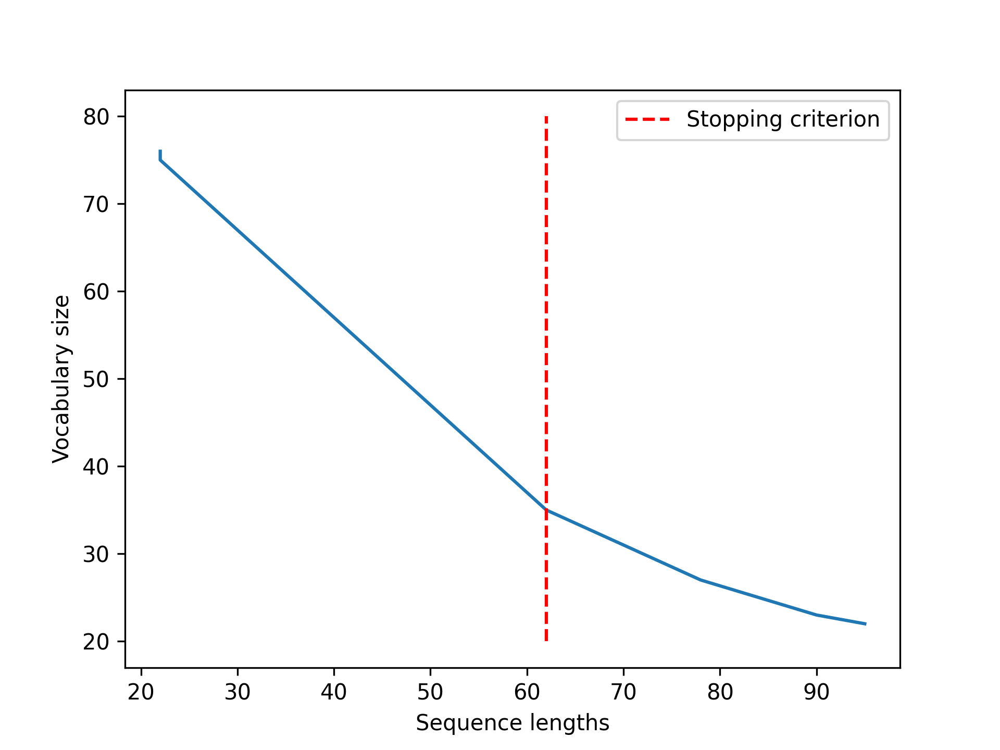

# **Course 2: Tokenization**


---
<!--footer: 'Course 2: Tokenization' -->

### What is tokenization?

Turning text...
```markdown
I love playing soccer!
```

...into *tokens*
```markdown
['I', 'love', 'play', 'ing', 'soccer', '!']
```

---
<!--_class: lead -->
# Historical Notions

---

### *Tokenization Origins*

The word token comes from linguistics
> *non-empty contiguous sequence of graphemes or phonemes in a document*

$\approx$

Split text on blanks

---

### *Tokenization Origins*
<br>
<br>


```markdown
old_tokenize("I love playing soccer!") = ['I', 'love', 'playing', 'soccer!']
```

- Different from *word-forms* :warning:
    - *damélo*  &rarr;  *da*/*mé*/*lo* (=*give*/*me*/*it*)

---

### *Tokenization Origins*

Natural language is split into...
<br>

- Sentences, utterances, documents... (*macroscopical*)
that are split into...<br>

    - Tokens, word-forms... (*microscopical*)

&rarr; Used for linguistic tasks (POS tagging, syntax parsing,...)

---

### Tokenization & ML

Machine Learning relies on **sub-word** tokenization:
*  Gives better performance
*  **Fixed-size vocabulary** often required
    * Out-Of-Vocabulary (OOV) issue

---

### Tokenization & ML

Evolution of modeling complexity w.r.t. the sequence length n
<center><table style="text-align: center;">
<tr><td><b>Model Type</b></td><td><b>Year</b></td><td><b>Complexity</b></td></tr>
<tr style="background: #Bfffbe;"><td>Tf-Idf</td><td>1972</td><td>O(1)</td></tr>
<tr style="background: #Ffe8be;"><td>RNNs</td><td>~1985</td><td>O(n)</td></tr>
<tr style="background: #Ffbebe;"><td>Transformers</td><td>2017</td><td>O(n<sup>2</sup>)</td></tr>
</table></center>

&rarr; Long sequences (e.g. character-level) are <mark>prohibitive</mark>

---

### Modern framework

- **Pre-tokenization** `"I'm lovin' it!" -> ["i", "am", "loving", "it", "!"]`
    * Normalization
        * Rules around punctuation (`_:_`, `_!`, ...)
        * Spelling correction (`"imo" -> "in my opinion"`)
        * Named entities (`"covid" -> "COVID-19"`)
        * ...
    * Rule-based segmentation
        * Blanks, punctuation, ...

---

### Modern framework

- **Tokenization** ```-> ["i", "am", "lov", "##ing", "it", "!"]```
    - Split units at subword level
    - Fixed vocabulary
    - **Trained** on text samples
    - Used in inference mode at *pre-processing* time

---
<!--_class: lead -->
# Sub-word Tokenization

---


### Granularity

<center></center>

---

### Granularity

&rarr; Trade-off between short sequences and reasonable vocabulary size

<ins>Fertility</ins>
For a string sequence $S$:
$$
\text{fertility}(S) = \frac{\text{ \# tokens }}{\text{ \# words } }
$$


---
<!--_class: lead -->
# Algorithms


---

### Byte-Pair Encoding (BPE)

Let's encode "*aaabdaaabac*" in an optimized way:

* Observed pairs: {*aa*, *ab*, *bd*, *da*, *ba*, *ac*}
* Observed **occurences**: {<mark>***aa*: 4**</mark>, *ab*: 2, *bd*: 1, *da*: 1, *ba*: 1, *ac*: 1}
* Set *X = aa*
* Encode *aaabdaaabac* &rarr; *XabdXabac*
* Start again from *XabdXabac*

---

### Byte-Pair Encoding (BPE)
<small>(current rules: *aa &rarr; X*)</small>
Let's encode "*XabdXabac*" in an optimized way:

* Observed pairs: {*Xa*, *ab*, *bd*, *dX*, *ba*, *ac*}
* Observed **occurences**: {<mark>***Xa*: 2**</mark>, <mark>***ab*: 2**</mark>, *bd*: 1, *dX*: 1, *ba*: 1, *ac*: 1}
* Set *Y = ab*
* Encode *XabdXabac* &rarr; *XYdXYac*
* Start again from *XYdXYac*

---

### Byte-Pair Encoding (BPE)
<small>(current rules: *aa &rarr; X*, *ab &rarr; Y*)</small>
Let's encode "*XYdXYac*" in an optimized way:

* Observed pairs: {*XY*, *Yd*, *dX*, *Ya*, *ac*}
* Observed occurences: {<mark>***XY*: 2**</mark>, *Yd*: 1, *dX*: 1, *Ya*: 1, *ac*: 1}
* Set *Z = XY*
* Encode *XYdXYac* &rarr; *ZdZac*
* Start again from *ZdZac*

---

### Byte-Pair Encoding (BPE)
<small>(current rules: *aa &rarr; X*, *ab &rarr; Y*, *XY &rarr; Z*)</small>
Let's encode "*ZdZac*" in an optimized way:

* Observed pairs: {*Zd*, *dZ*, *Za*, *ac*}
* Observed occurences: {*Zd*: 1, *dZ*: 1, *Za*: 1, *ac*: 1}
* **All pairs are unique => END**

---

### Byte-Pair Encoding (BPE)
Final encoding: *aaabdaaabac* &rarr; *ZdZac*

with **merge rules**:

1) *aa &rarr; X*
2) *ab &rarr; Y*
3) *XY &rarr; Z*

<ins>Decoding</ins>: follow merge rules in opposite order

---

### BPE Training - pre-tokenization

```python
training_sentences = [
    "Education is very important!",
    "A cat and a dog live on an island",
    "We'll be landing in Cabo Verde",
]
```
<center> => </center>

```python
pretokenized = ["education_", "is_", "very_", "important_", "!_", "a_",
         "cat_", "and_", "a_", "dog_", "live_", "on_", "an_", "island_",
         "we", "'", "ll_", "be_", "landing_", "in_", "cabo_" "Verde_"
]
```

---

### BPE Training - iteration 1
```python
tokenized = [
    ['e', 'd', 'u', 'c', 'a', 't', 'i', 'o', 'n', '_'], ..., ['i', 'm', 'p', 'o', 'r', 't', 'a', 'n', 't', '_'], ['!', '_'],
    ['a', '_'], ['c', 'a', 't', '_'], ['a', 'n', 'd', '_'],  ..., ['o', 'n', '_'], ['a', 'n', '_'], ['i', 's', 'l', 'a', 'n', 'd', '_'],
    ['w', 'e'], ["'"], ['l', 'l', '_'], ['b', 'e', '_'], ['l', 'a', 'n', 'd', 'i', 'n', 'g', '_'], ..., ['v', 'e', 'r', 'd', 'e', '_']
]
```
&rarr; Most common pair: `"an"`

```python
tokenized = [
    ['e', 'd', 'u', 'c', 'a', 't', 'i', 'o', 'n', '_'], ..., ['i', 'm', 'p', 'o', 'r', 't', 'an', 't', '_'], ['!', '_'],
    ['a', '_'], ['c', 'a', 't', '_'], ['an', 'd', '_'],  ..., ['o', 'n', '_'], ['an', '_'], ['i', 's', 'l', 'an', 'd', '_'],
    ['w', 'e'], ["'"], ['l', 'l', '_'], ['b', 'e', '_'], ['l', 'an', 'd', 'i', 'n', 'g', '_'], ..., ['v', 'e', 'r', 'd', 'e', '_']
]
```

---

### BPE Training - iteration 2
```python
tokenized = [
    ['e', 'd', 'u', 'c', 'a', 't', 'i', 'o', 'n', '_'], ..., ['i', 'm', 'p', 'o', 'r', 't', 'an', 't', '_'], ['!', '_'],
    ['a', '_'], ['c', 'a', 't', '_'], ['an', 'd', '_'],  ..., ['o', 'n', '_'], ['an', '_'], ['i', 's', 'l', 'an', 'd', '_'],
    ['w', 'e'], ["'"], ['l', 'l', '_'], ['b', 'e', '_'], ['l', 'an', 'd', 'i', 'n', 'g', '_'], ..., ['v', 'e', 'r', 'd', 'e', '_']
]
```
&rarr; Most common pair: `"ca"`

```python
tokenized = [
    ['e', 'd', 'u', 'ca', 't', 'i', 'o', 'n', '_'], ..., ['i', 'm', 'p', 'o', 'r', 't', 'an', 't', '_'], ['!', '_'],
    ['a', '_'], ['ca', 't', '_'], ['an', 'd', '_'],  ..., ['o', 'n', '_'], ['an', '_'], ['i', 's', 'l', 'an', 'd', '_'],
    ['w', 'e'], ["'"], ['l', 'l', '_'], ['b', 'e', '_'], ['l', 'an', 'd', 'i', 'n', 'g', '_'], ..., ['v', 'e', 'r', 'd', 'e', '_']
]
```
---
### BPE Training - iteration 14 (final)
```python
tokenized = [
    ['e', 'd', 'u', 'cat', 'i', 'on_'], ['is', '_'], ['ver', 'y', '_'], ['i', 'm', 'p', 'o', 'r', 't', 'an', 't', '_'], ['!', '_'],
    ['a_'], ['cat', '_'], ['and_'], ['a_'], ..., ['on_'], ['an', '_'], ['is', 'l', 'and_'],
    ['w', 'e'], ["'"], ..., ['l', 'and', 'i', 'n', 'g_'], ['i', 'n_'], ['ca', 'b', 'o', '_'], ['ver', 'd', 'e_']
]
```
"Created" tokens:
```python
['an', 'ca', 'n_', 've', 'and', 'cat', 'on_', 'is', 'ver', 'a_', 'and_', 'g_', 'e_']
```

&rarr; English common words (a, and, on, is, ...)
&rarr; `and` vs `and_`

---

### BPE Training - iteration 14 (final)
```python
tokenized = [
    ['e', 'd', 'u', 'cat', 'i', 'on_'], ['is', '_'], ['ver', 'y', '_'], ['i', 'm', 'p', 'o', 'r', 't', 'an', 't', '_'], ['!', '_'],
    ['a_'], ['cat', '_'], ['and_'], ['a_'], ..., ['on_'], ['an', '_'], ['is', 'l', 'and_'],
    ['w', 'e'], ["'"], ..., ['l', 'and', 'i', 'n', 'g_'], ['i', 'n_'], ['ca', 'b', 'o', '_'], ['ver', 'd', 'e_']
]
```
"Created" tokens:
```python
['an', 'ca', 'n_', 've', 'and', 'cat', 'on_', 'is', 'ver', 'a_', 'and_', 'g_', 'e_']
```

&rarr; English common words (a, and, on, is, ...)
&rarr; `and` vs `and_`

---

### BPE - Granularity
<center></center>

---

### WordPiece

* Based on merge rules too
* Initial processing is different:

BPE:
```python
["education", "is"] => [["e", "d", "u", ..., "n", "_"], ["i", "s", "_"]]
```

WordPiece:
```python
["education", "is"] => [["e", "##d", "##u", "##c",...], ["i", "##s"]]
```
---

### WordPiece

* Pairs are scored using this score function:
$$
S((t_1, t_2)) = \frac{freq(t_1t_2)}{freq(t_1)freq(t2)}
$$

* if $t_1$ and $t_2$ are common, less likely to merge
    * ex: *dream/##ing* &rarr; not merged
* if $t_1$ and $t_2$ are rare but $t_1t_2$ is common, <mark>more</mark> likely to merge
    * ex: *pulv/##erise* &rarr; *pulverise*

---

### Unigram

Unigram is working in the opposite direction:
* Start from a (too) big subword vocabulary
* Gradually eliminate tokens <mark>that won't be missed</mark> :wave:
* **Score** all possible segmentations and take max:
    * Ex: *brew*
        * S(*b*/*r*/*e*/*w*) &rarr; P(*b*) x P(*r*) x P(*e*) x P(*w*) = 0.024
        * S(*br*/*e*/*w*) &rarr; P(*br*) x P(*e*) x P(*w*) = 0.031
        ...

---

### Unigram - Inference

:warning: A string of length $n$ has $O(2^n)$ possible segmentations :warning:

&rarr; Unigram is using the <mark>Viterbi</mark> algorithm:
* Observation: $P(S^*(w_{:i+1})) \leq P(S^*(w_{:i}))$ <small>($S^*$: best segmentation)</small>

---

### Unigram - Inference

Example: *email*

* Starting from letter *e*
    * For all <ins>ending letters</ins>, what is the best segmentation if last token starts from *e*?
        * S(*e*) = 0.15
        * S(*em*) = 0.02
        ...
        * S(*email*) = 0.001

---
### Unigram - Inference

Example: *email*

* Starting from letter *m*
    * For all <ins>ending letters</ins>, what is the best segmentation if last token starts from *m*?
        * S(*e* /*m*) = 0.1
        ...
        * S(*e* /*mail*) = 0.2
* Remark: we've seen S(*em*) and S(*e* /*m*) &rarr; we know the best segmentation that ends at *m* !

---
### Unigram - Inference

Example: *email*

* Starting from letter *a*
    * For all <ins>ending letters</ins>, what is the best segmentation if last token starts from *a*? **(hence after *e* /*m*)**
        * S(*e* /*m* /*a*) = 0.023
        ...
        * S(*e* /*m*/*ail*) = 0.001
* Remark: we've seen S(*ema*), ..., S(*e* /*m*/ *a*) &rarr; we know the best segmentation that ends at *a* ! (here: *e* /*ma* is best)

---
### Unigram - Inference

Example: *email*

* Starting from letter *i*
    * For all <ins>ending letters</ins>, what is the best segmentation if last token starts from *i* ? (hence after *e* /*ma*)
        * S(*e* /*ma* /*i* ) = 0.004
        * S(*e* /*ma*/ *il* ) = 0.03
* Remark: we only have 2 candidates left! (here: *ema* /*i* is best)

---
### Unigram - Inference

Example: *email*

* Starting from letter *l*
    * For all <ins>ending letters</ins>, what is the best segmentation if last token starts from *l* ? (hence after *ema* /*i*)
        * S(*ema* /*i* /*l* ) = 0.002

Takeaway: At each *start* position, we know what the best segmentation up to *start* is => we just need to explore after *start*

---
### Unigram - Training

* Start from a very big vocabulary
* Infer on all pre-tokenized units $w \in W$ and get total score as:

---
### Unigram - Training

- Start from a very big vocabulary
- Infer on all pre-tokenized units $w \in W$ and get total score as:
$$
score(V, W) = \sum_{w=(t_1...t_n) \in W} -\log(P(t_1)\times ... \times P(t_n))
$$
* For all token $t$, compute $score(V - \{t\}, W)$
* Remove the token that **least decreases** the score when removed
* Iterate :repeat: <small>(until you have desired vocabulary size)</small>

---
<!--_class: lead -->
# Limits & Alternatives

---
### Limits

* Fixed vocabulary...
    * ... leads to OOV (out-of-vocabulary)
    * ... scales poorly to 100+ languages (and scripts)
    * ... can cause over-segmentation
    * ... is not robust to misspellings

```python
bpe("artificial intelligence is real bro") => 'artificial', 'intelligence', 'is', 'real', 'bro'
```

```python
bpe("aritificial inteligense is reaal bro") => 
'ari', '##ti', '##fi', '##cial', 'intel', '##igen', '##se', 'is', 're', '##aa', '##l', 'bro'
```

---
### Alternatives - BPE dropout

&rarr; Randomly removes part of the vocabulary during training
<br>

<center></center>
=> makes models more robust to misspellings

---
### Alternatives - CharacterBERT
<center></center>

---
### Alternatives - ByT5

- Gives directly bytes (~characters) as inputs to the model
<center></center>

=> more robust and data efficient BUT ~10 times slower and more hardware consumption

---
### Neural tokenization - CANINE

- Downsamples characters into 4$\times$ smaller sequences
<center></center>


---
### Neural tokenization - MANTa
- Allows the language model to learn its *own* mapping
<center></center>

---
### Takeaways
* Tokenization: Art of splitting sentences/words into meaningful smaller units
* In ML: subword tokenization is <small>(very)</small> commonly used
* Three main algorithms
    * **BPE**: iteratively learn most frequent merges
    * **WordPiece**: BPE with adjusted frequency score
    * **Unigram**: Start big and remove tokens that won't be missed
* When facing noisy and/or complex text, alternatives exist