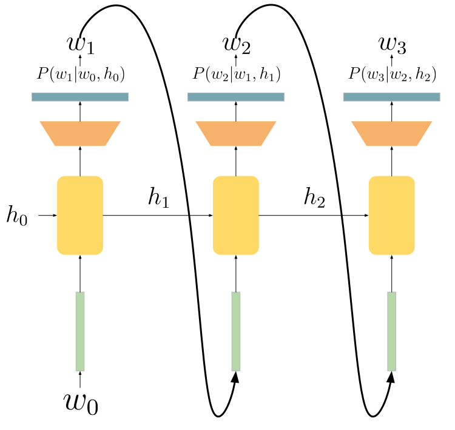

# **Course 3: Language Modeling**

---
<!--footer: 'Course 3: Language Modeling' -->

**How does it really work?**

---
<!--_class: lead -->
# What is Language Modeling?

---

### Definition

- A sequence of tokens $(w_1, w_2, ..., w_n)$
- For a position $i$, a language model (**LM**) predicts
$$
P(w_i\ | (w_j)_{j\neq i}) \in \Delta^V
$$

- In words: a LM predicts the probability of a token given its context

---

### Example

*I went to the **???** yesterday*

P(*park* |  *I went to the **???** yesterday*) = 0.1

P(*zoo* |  *I went to the **???** yesterday*) = 0.07

...

P(*under* |  *I went to the **???** yesterday*) = 0

---

### Why is it hard?

* **Large vocabularies**: 170,000 English words
* **Lots of possible contexts**:
    * For $V$ possible tokens, there are $V^L$ contexts of size $L$ (in theory)
* **Inherent uncertainty**: not obvious even for humans

---

### Basic approach - Unigram

- Learn the *non-contextual* probability (=frequency) of each token:
$$
P(w_i\ | (w_j)_{j\neq i}) = f
$$

**Example**
*chart against operations at influence the surface plays crown a inaro the three @ but the court lewis on hand american of seamen mu role due roger executives*

---

### Include context - Bigram

- Predict based on the last token only:
$$
P(w_i\ | (w_j)_{j\neq i}) = P_{\theta}(w_i | w_{i-1})
$$

- (MLE): Measure next token frequency

**Example**
*the antiquamen lost to dios nominated former is carved stone oak were problematic, 1910. his willingness to receive this may have been seen anything*

---

### Include more context - n-gram

- Predict based on the $n$ last tokens only:
$$
P(w_i\ | (w_j)_{j\neq i}) = P_{\theta}(w_i | w_{i-n}...w_{i-1})
$$

- (MLE): Measure occurences of tokens after $w_{i-n}...w_{i-1}$

**Example (n=4)**
*eva gauthier performed large amounts of contemporary french music across the united states marshals service traveled to frankfurt, germany and took custody of the matthews*

---

### Statistical n-grams: pro/cons

* Strenghts:
    * Easy to train
    * Easy to interpret
    * Fast inference
* Limitations:
    * Very limited context
    * **Unable to extrapolate** : can only model what it has seen

---

### The embedding paradigm

---

### LM with RNNs

---

### LM with RNNs - Training

- $\theta$: parameters of the RNN
- $(w_1,...,w_n)$: training sequence
- Cross-entropy loss $\mathcal{L}_{ce}$:
$$
\mathcal{L}_{ce}(w, \theta) = - \sum_{i=2}^{n} 1_{w_i} \cdot \log P_{\theta}(w_i |w_{i-1}, h_{i-1})
$$
- Train via back-propagation + SGD

---

### Reminder - Back-propagation

---

### Reminder - Stochastic Gradient Descent

* **Goal** : Minimize a loss function $\mathcal{L}(X, \theta)$ for given data $X$ with respect to model parameters $\theta$

* **Method** : 
    * Split $X$ in smaller parts $x^i$ (called mini-batches)
    * Compute $\mathcal{L}(x^i, \theta)$ (forward) and $\nabla_{\theta} \mathcal{L}(x^i, \theta)$ (back-prop)
    * Update: $\theta \leftarrow \theta - \eta \nabla_{\theta} \mathcal{L}(x^i, \theta)$ &nbsp; &nbsp;  &nbsp; &nbsp; ($\eta \ll 1$, learning rate)

---

### LM with RNNs: Generation

---

### RNNs: pro/cons
* Strenghts
    * Still relatively fast to train
    * ... and for inference ($O(L)$)
    * **Can extrapolate** (works with continuous features)
* Limitations
    * **Context dilution** when information is far away

---

### Extending RNNs: BiLSTMs
- LSTM: improves context capacity
- Read the sequence in both directions

---
<!--_class: lead -->
# Transformers
---
### Information flow - RNN
How many steps between source of info and current position?
* *What is the previous word?* => $O(L)$
* *What is the subject of verb X?* => $O(L)$
* *What are the other occurences of current word?* => $O(L^2)$
* ...
---
### Information flow - Transformers
How many steps between source of info and current position?
* *What is the previous word?* => $O(1)$
* *What is the subject of verb X?* => $O(1)$
* *What are the other occurences of current word?* => $O(1)$
* ... => $O(1)$

---
### Outside Transformers
* A Transformer network $T_{\theta}$
* Input: Sequence of vectors $(e_1,...,e_n) \in \mathbb{R}^D$
* Output: Sequence of vectors $(h_1,...,h_n) \in \mathbb{R}^D$
* Each $h_i$ may depend on the <ins>whole</ins> input sequence $(e_1,...,e_n)$

---
### Inside Transformers

---
### Inside Transformers : Embeddings
Before going in the network:
* Given an input token sequence $(w_1,...,w_n)$
* We retrieve token embeddings $(e_w(w_1),..., e_w(w_n)) \in \mathbb{R}^D$
* We retrieve position embeddings $(e_p(1),..., e_p(n))\in \mathbb{R}^D$
* We compute input embeddings: $e_i = e_w(w_i) + e_p(i)$

---
### Inside Transformers : Self-attention

---
### Inside Transformers : Q and K
=> Model interactions between tokens:

---
### Inside Transformers : Q and K
- Each row of $QK^T$ is then normalized using softmax
- Interpretable patterns:

---
### Inside Transformers : Q and K
- Formally:
$$
A_{i,j} = \frac{1}{\sqrt{d_h}} \cdot \frac{e^{(QK^T)_{i,j}}}{\sum_{k}e^{(QK^T)_{i,k}}}
$$

where $d_h$ is the hidden dimension of the model

---
### Inside Transformers : A and V

---
### Inside Transformers : Self-attention summary

  <!-- Left half (image) -->
  

  <!-- Right half (bullet points) -->
  

    <ul>
      <li>Inputs are mapped to Queries, Keys and Values</li>
      <li>Queries and Keys are used to measure interaction (A)</li>
      <li>Interaction weights are used to "select" relevant Values combinations</li>
      <li><b>Complexity: O(L^2)</b></li>
    </ul>
  

  

    

  

---
### Inside Transformers : Multi-head attention

---
### Inside Transformers : LayerNorm
- Avoids gradient explosion

---
### Inside Transformers : Output layer
 

---
<!--_class: lead -->
# Encoder Models

---
### Masked Language Models

---
### BERT (Devlin et al., 2018)
- Pre-trained on 128B tokens from Wikipedia + BooksCorpus
- Additional Next Sentence Prediction (NSP) loss
- Two versions:
  - BERT-base (110M parameters)
  - BERT-large (350M parameters)
- **Cost**: ~1000 GPU hours

---
### RoBERTa (Liu et al., 2019)
- Pre-trained on <s>128B</s> **2T** tokens from web data (BERT x10)
- **No more** Next Sentence Prediction (NSP) loss
- Two versions:
  - RoBERTa-base (110M parameters)
  - RoBERTa-large (350M parameters)
- Better results in downstream tasks
- **Cost**: ~25000 GPU hours

---
### Multilingual BERT (mBERT)
- Pre-trained on 128B tokens from multilingual Wikipedia
- 104 languages
- One version:
  - mBERT-base (179M parameters)
- **Cost**: *unknown*

---
### XLM-RoBERTa (Conneau et al., 2019)
- Pre-trained on **63T** tokens from CommonCrawl
- 100 languages
- Two versions:
  - XLM-RoBERTa-base (279M parameters)
  - XLM-RoBERTa-large (561M parameters)
- **Cost**: ~75000 GPU hours

---
### ELECTRA (Clark et al., 2020)

---
### ELECTRA (Clark et al., 2020)
- Pre-trained on **63T** tokens from CommonCrawl
- 100 languages
- Three versions:
  - ELECTRA-small (14M parameters)
  - ELECTRA-base (110M parameters)
  - ELECTRA-large (350M parameters)
- Really better than BERT/RoBERTa
- **Cost**: =BERT

---
### Encoders: Fine-tuning

---
### Encoders: Classical applications
* Natural Language Inference (NLI)
  * *I like cake!* / *Cake is bad* => <s>same</s>|<s>neutral</s>|**opposite**

* Text classification (+ clustering)
  * *I'm so glad to be here!* => joy

* Named Entity Recognition (NER)
  * *I voted for Obama!* => (Obama, pos:3, class:PER)
* and many others...

---
<!--_class: lead -->
# Decoders
---
### Decoders - Motivation

* Models that are designed to **generate text**
* Next-word predictors:
$$
P(w_i\ | (w_j)_{j\neq i}) = P_{\theta}(w_i | w_1...w_{i-1})
$$
* **Problem**: How do we impede self-attention to consider future tokens?

---
### Decoders - Attention mask

 

- Each attention input can only attend to previous positions

---
### Decoders - Attention mask

 

- Each attention input can only attend to previous positions