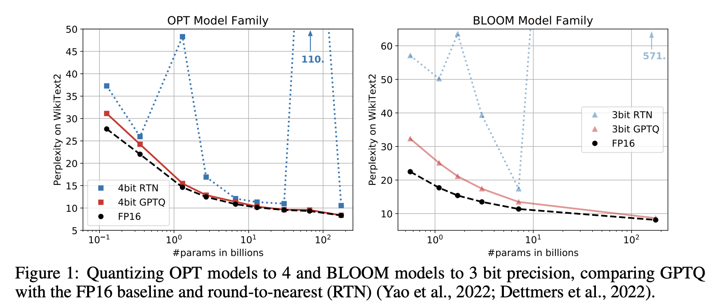

# **Course 4: Efficient NLP**

---
<!--footer: 'Course 4: Efficient NLP' -->

### The cost of pre-training LMs

---

### The cost of using LMs

---

<!--_class: lead -->
# Efficient training

---
### Scaling Laws

- Scaling Laws for Neural Language Models (Kaplan et al. 2020)

---
### Chinchilla Scaling Laws

* Refinement using more data points & better training recipe
* Given $C$ FLOPS, what model size $N$ and training tokens $D$ should one use?

---
### Chinchilla Scaling Laws

- Propose a form for the final loss:
$$
L(N, D) = E + \frac{A}{N^\alpha} + \frac{B}{D^\beta}
$$

- Fit it on data points
    - E = 1.69 ("*entropy of natural language*")
    - A = 406.4, B = 410.7, $\alpha$ = 0.34, $\beta$ = 0.28

---
### Chinchilla Scaling Laws
 
 

* Compute $C = O(ND)$ ($C\simeq6ND$)
* For a given compute level $C$, there exist an optimal $N^*$ and $D^*$
    * Training a bigger model on less data => worse
    * Training a smaller model on more data => worse

---
### Chinchilla Scaling Laws - In practice
* Train for longer than announced by laws
    * Why?
* Over-train smaller models
    * Trade training compute for inference compute
* Example: Mistral-7B model

---
### Chinchilla Scaling Laws - In practice
 

---
### Training LMs

* Batch size matters:
    * No bigger than 1-2M tokens (Kaplan et al., 2020)
    * Maximize parallel computation

* Float precision:
    * `float16`: reduces memory usage, good with V100-gen GPUs
    * `bfloat16`: more stability, but only usable with A100-gen GPUs

---
### Training LMs - Efficient implementations
- FlashAttention (Dao et al. 2022)

---
### Training LMs - Efficient implementations
- FlashAttention2 (Dao et al. 2023)

---
### Training LMs - Efficient implementations
- xFormers & Memory-efficient attention (Rabe et al. 2021)
    - Classical implementation  

    - Memory-efficient implementation  

- ~SOTA on V100-gen GPUs

---
### Training LMs - Efficient variants
- Linear attention (e.g. Beltagy et al. 2020)

- Can be used to adapt model for efficient inference
- Used in Mistral-7B

---
### Training LMs - Large-scale training
* Dream scenario:
    * Model fits on the GPU
    * Forward + backward fit with the `batch_size`
    * Optimization fits memory

---
### Training LMs - Large-scale training
- Optimization OOM scenario
    * Model fits on the GPU
    * Forward + backward fit with the `batch_size`
    * <ins> Optimization saturates GPU </ins>
* Use memory-efficient optimizers
    * [Adafactor](https://arxiv.org/abs/1804.04235): factor momentum matrix in Adam
    * [CAME](https://arxiv.org/abs/2307.02047): regularize Adafactor
    * [LION](https://arxiv.org/abs/2302.06675): only tracks momentum

---
### Training LMs - Large-scale training
- Forward/backward OOM scenario
    - Model fits on the GPU
    - <ins>Forward + backward saturates with the `batch_size`</ins>
* Use gradient accumulation
    * Compute forwards with `micro_batch_size` $\ll$ `batch_size`
    * Sum `micro_batch_size//batch_size` gradients
    * Backward once

---
### Training LMs - Multi-GPU training
* **Distirbuted Data Parallel (DDP)** with $k$ GPUs
    * Copy the model on the $k$ GPUs
    * Send a micro-batch to each GPU
    * Compute forward/backward in parallel on each GPU
    * *Send* gradients to one GPU & optimize
    * *Send* weight updates to each GPU

---
### Training LMs - Multi-GPU training
- Model OOM scenario
    - Model does not fit on one GPU (e.g. `micro_batch_size=1` fails)
- Model parallelism  

---
### Training LMs - FSDP

---
### Training LMs - DeepSpeed
- Similar to FSDP:
    - Shares model weights...
    - but also optimizer states...
    - and gradients
- For relevant sizes: not that different in speed :hourglass:

---
### Adapting LMs - Adapters

- Parameter-Efficient Transfer Learning for NLP (Houlsby et al. '19)

---
### Adapting LMs - LoRA

- Low-Rank Adaptation of Large Language Models (Hu et al. '21)

---
### Adapting LMs - LoRA vs Adapters
- Better + more stable results across hyper-parameters

---

<!--_class: lead -->
# Efficient inference

---

### Previous methods hold
* Efficient attention implementations & variants
    * FlashAttention / xFormers
    * Linear attention
* Model parallelism (FSDP & DeepSpeed)
* LORA weights for fast model "switching"
    * Keep big model in memory
    * Load task-specific LoRA when required

---

### Quantization
- Changes the data type of a model (e.g. `float32 -> int4`)
- Models are usually trained in `float16` or `bfloat16` for stability
- Needs rescaling: 
$$ Q_{i_4}(0.3)  \neq 0$$

---

### LM quantization
- GPTQ (Frantar et al. 2023)

---

### LM quantization - GPTQ

Consider quantization as an optimization problem:
$$
\argmin_{\hat{W}} || WX - \hat{W}X ||_2^2
$$
where $W$ is a weight matrix to quantize into $\hat{W}$, and $X$ are data points (e.g. token sequences)

---

### LM quantization - GPTQ

* For each row, quantize some $W_{ij}$ by solving the quadratic problem and adjust the non-quantized coefficients of $W_i$ to minimize impact
* *Empirical*: update order does not matter
* Update at smaller scale and batch whole matrix updates
* Precompute Hessian (needed for adaptation) on non-quantized coefficients since they can be taken left-to-right

---

### LM quantization - GPTQ
- A matter of minutes/hours (on a single A100 GPU)

---

### LM quantization - GPTQ
- Inference speed/memory is greatly increased:

- While performance is maintained (OPT perplexity :arrow_down:)

---

### Managing KV cache - vLLM
- Paged Attention (Kwon et al. 2023)

---

### Managing KV cache - vLLM
- Better throughput + parallelization across requests

---

### Long KV cache - StreamingLLM
- Efficient Streaming Language Models with Attention Sinks (Xiao et al. 2023)

---

<!--_class: lead -->
# Model reduction

---

### DistilBERT (Sanh et al. 2019)
 

---

### DistilBERT (Sanh et al. 2019)
* Can be expensive if teacher is big
* Still loses performance 

---

### Sheared Llama (Xia et al. 2023)
* Remove weights that minimize loss increase 

* Continue the pretraining of the obtained reduced model

---

### Sheared Llama (Xia et al. 2023)
- Get a good model with much less data/compute

