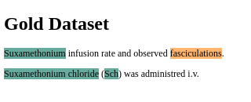

# **Advanced NLP tasks**

---

<!--footer: "Course 6: Advanced NLP tasks" -->

### Contents

1. Named Entity Recognition (NER)
    a. Part-of-Speech Tagging (POS)
    b. Conditional Random Field (CRF)
2. Sentiment Analysis
3. QuestionAnswering (QA)
4. Natural Language Inference (NLI)
    a. Going further: LM as knowledge graphs
5. Exploit LLMs capacities: Chain-of-thoughts & In context learning

---

<!--_class: lead -->
## Named Entity Recognition (NER)

---

### NER

Named entity recognition (NER), aims at identifying real-world entity mentions from texts, and classifying them into predefined types.

---

### NER

We wish to predict an output vector $\textbf{y} = (y_{1}, y_{1}, ..., y_{L})$, of random variables, given an observed characteristic vector $\textbf{x} = (x_{1}, x_{2}, ..., x_{L})$

$\textbf{y}$ takes it value from a list of $N$ possible values.

---

### Part-of-Speech Tagging (POS)

POS is the process of mapping words in a text with a label corresponding to their grammatical class.

("He", "likes", "to", "drink", "tea"), $\rightarrow$ ("PERSONAL PRONOUN", "VERB", "TO", "VERB", "NOUN").

---

### Part-of-Speech Tagging (POS)

There several levels of granularity.: using [the tag set for english](https://www.ibm.com/docs/en/wca/3.5.0?topic=analytics-part-speech-tag-sets)

("He", "likes", "to", "drink", "tea"), $\rightarrow$ ("PRP", "VBP", "TO", "VB", "NN").

---

### Conditional Random Field (CRF)

---

### Conditional Random Field (CRF)

For each token in a sentence at position $l$ we want to compute a probability $p$ to belong to a class $n$.

$$p: f(\textbf{x}, \theta)_{l} \mapsto ?$$
with $p \in [0, 1]$

---

### Conditional Random Field (CRF)

Using the softmax function?

$$p: f(\textbf{x}, \theta)_{l}^ \mapsto \frac{e^{f(\textbf{x}, \theta)_{l}^{(n)}}}{\sum_{n'=1}^{N}e^{f(\textbf{x}, \theta)^{(n')}_{l}}}$$

The probability given by the softmax function will not encode non-local dependencies!

---

### Conditional Random Field (CRF)

We need to take sequential decisions: what if we add transition scores into our softmax?

$$p: f(\textbf{x}, \theta)_{l} \mapsto \frac{e^{f(\textbf{x}, \theta)_{l}^{(n)} + t(y^{(n)}_{l}, y_{l-1})}}{\sum_{n'=1}^{N}e^{f(\textbf{x}, \theta)_{l}^{(n')} + t(y^{(n')}_{l}, y_{l-1})}}$$

But this is the probability for one token to belong to a class, we want to compute the probability of a whole sequence of label at once...

---

### Conditional Random Field (CRF)

$$\begin{flalign}
P(\textbf{y}|\textbf{x}) &= \prod_{l=2}^{L}p(\textbf{y}|f(\textbf{x}, \theta)_{l})\\
\\
&= \prod_{l=2}^{L}\frac{e^{f(\textbf{x}, \theta)_{l}^{(n)} + t(y^{(n)}_{l}, y_{l-1})}}{\sum_{n'=1}^{N}e^{f(\textbf{x}, \theta)_{l}^{(n')} + t(y^{(n')}_{l}, y_{l-1})}}\\
\end{flalign}$$

---

$$\begin{flalign}
P(\textbf{y}|\textbf{x}) &= \frac{exp[{\sum_{l=2}^{L}\textbf{(}f(\textbf{x}, \theta)_{l}^{(n)} + t(y^{(n)}_{l}, y_{l-1})}\textbf{)}]}{\sum_{n'=1}^{N}exp[{\sum_{l=2}^{L}\textbf{(}f(\textbf{x}, \theta)_{l}^{(n')} + t(y^{(n')}_{l}, y_{l-1})}\textbf{)}]}\\
\\
&= \frac{exp[{\sum_{l=2}^{L}\textbf{(}U(\textbf{x}, y^{(n)}_{l}) + T(y^{(n)}_{l}, y_{l-1})}\textbf{)}]}{\sum_{n'=1}^{N}exp[{\sum_{l=2}^{L}\textbf{(}U(\textbf{x}, y^{(n')}_{l}) + T(y^{(n')}_{l}, y_{l-1})}\textbf{)}]}\\
\\
&= \frac{exp[{\sum_{l=2}^{L}\textbf{(}U(\textbf{x}, y^{(n)}_{l}) + T(y^{(n)}_{l}, y_{l-1})}\textbf{)}]}{Z(\textbf{x})}

\end{flalign}$$

---

### Conditional Random Field (CRF)

$Z(\textbf{x})$ is commonly referred as the partition function. However, its not trivial to compute: we'll end up with a complexity of $\mathcal{O}(N^{L})$.

Where $N$ is the number of possible labels and $L$ the sequence length.

How do we proceed?

---

### Conditional Random Field (CRF)

---

### Conditional Random Field (CRF)

---

### Conditional Random Field (CRF)

---

### Conditional Random Field (CRF)

Negative log-likelihood:

$$\begin{flalign}
\mathcal{L} &= -log(P(\textbf{y}|\textbf{x}))\\

&= -log(\frac{exp[{\sum_{l=2}^{L}\textbf{(}U(\textbf{x}, y^{(n)}_{l}) + T(y^{(n)}_{l}, y_{l-1})}\textbf{)}]}{Z(\textbf{x})})\\

&= -[log(exp[{\sum_{l=2}^{L}\textbf{(}U(\textbf{x}, y^{(n)}_{l}) + T(y^{(n)}_{l}, y_{l-1})}\textbf{)}]) - log(Z(\textbf{x}))]\\

&= log(Z(\textbf{x})) - {\sum_{l=2}^{L}\textbf{(}U(\textbf{x}, y^{(n)}_{l}) + T(y^{(n)}_{l}, y_{l-1})}\textbf{)} 
\end{flalign}$$

---

### Conditional Random Field (CRF)

There is an effective way to compute $log(Z(\textbf{x}))$ with a complexity of $\mathcal{O}(L)$ using [the Log-Sum-Exp trick](https://gregorygundersen.com/blog/2020/02/09/log-sum-exp/).

$$\begin{flalign}
log(Z(\textbf{x})) &= log(\sum_{n'=1}^{N}exp[{\sum_{l=2}^{L}\textbf{(}U(\textbf{x}, y^{(n')}_{l}) + T(y^{(n')}_{l}, y_{l-1})}\textbf{)}])\\

&= c + log(\sum_{n'=1}^{N}exp[{\sum_{l=2}^{L}\textbf{(}U(\textbf{x}, y^{(n')}_{l}) + T(y^{(n')}_{l}, y_{l-1})}\textbf{)} - c])
\end{flalign}$$

---

### Conditional Random Field (CRF)

If we fix $c = max\{U(\textbf{x}, y^{(1)}_{l}) + T(y^{(1)}_{l}, y_{l-1}), ..., U(\textbf{x}, y^{(N)}_{l}) + T(y^{(N)}_{l}, y_{l-1})\}$ we ensure that the largest positive exponentiated term is $exp(0)=1$.

---

<!--_class: lead -->
## Sentiment Analysis

---

### Sentiment Analysis

**Sentiment analysis** is a sentence classification task aiming at **automatically mapping data to their sentiment**.

It can be **binary** classification (e.g., positive or negative) or **multiclass** (e.g., enthusiasm, anger, etc)

---

### Sentiment Analysis

---

### Sentiment Analysis

The loss can be the likes of cross-entropy (CE), binary cross-entropy (BCE) or KL-Divergence (KL).

$$\mathcal{L}_{CE} = - \frac{1}{N} \sum_{n'=1}^{N}y^{(n)}.log(f(\textbf{x}, \theta)^{(n)})$$

$$\mathcal{L}_{BCE} = - y^{(n)}.log(f(\textbf{x}, \theta)^{(n)}) + (1 - y^{(n)}).(1 - f(\textbf{x}, \theta)^{(n)})$$

$$\mathcal{L}_{KL} = - \frac{1}{N} \sum_{n'=1}^{N}y^{(n)}.log(\frac{y^{(n)}}{f(\textbf{x}, \theta)^{(n)}})$$

---

<!--_class: lead -->
## Question Answering (QA)

---

### Question Answering (QA)

**QA** is the task of **retrieving a span of text from a context** that is best suited to answer a question.

This task is extractive -> **information retrieval**

---

### Question Answering (QA)

---

### Question Answering (QA)

---

### Question Answering (QA)

The loss is the cross entropy over the output of the starting token and the ending one:

$$\mathcal{L}_{CE_{QA}} = \mathcal{L}_{CE_{start}} + \mathcal{L}_{CE_{end}}$$

---

<!--_class: lead -->
## Natural Language Inference (NLI)

---

### Natural Language Inference (NLI)

**NLI** is the task of **determining whether a "hypothesis" is true (entailment), false (contradiction), or undetermined (neutral)** given a "premise". [1]

---

### Natural Language Inference (NLI)

Premise|Label|Hypothesis
-------|-----|----------
A man inspects the uniform of a figure in some East Asian country.|contradiction|The man is sleeping.
An older and younger man smiling.|neutral|Two men are smiling and laughing at the cats playing on the floor.
A soccer game with multiple males playing.|entailment|Some men are playing a sport.

---

### Natural Language Inference (NLI)

---

### Natural Language Inference (NLI)

The loss is simply the cross entropy or the divergence over the output of the `CLS` token and the true label.

$$\mathcal{L}_{NLI} = \mathcal{L}_{CE_{CLS}}$$

We are trying to compress the information about both sentence in one `CLS` token via attention and decide about their relationship.

Is it possible to help the model infering more information with les text data?

---

### Going Further: LM as Knowledge Graphs

Dragon

---

<!--_class: lead -->
## Questions?

---

### References

[1] https://paperswithcode.com/task/natural-language-inference

[2] Singla, S., & Feizi, S. (2021). Causal imagenet: How to discover spurious features in deep learning. arXiv preprint arXiv:2110.04301, 23.

[3] Carmon, Y., Raghunathan, A., Schmidt, L., Duchi, J. C., & Liang, P. S. (2019). Unlabeled data improves adversarial robustness. Advances in neural information processing systems, 32.

---

[4] [Pretrained Transformers Improve Out-of-Distribution Robustness](https://aclanthology.org/2020.acl-main.244) (Hendrycks et al., ACL 2020)

[5] Brown, T., Mann, B., Ryder, N., Subbiah, M., Kaplan, J. D., Dhariwal, P., ... & Amodei, D. (2020). Language models are few-shot learners. Advances in neural information processing systems, 33, 1877-1901.

[6] Zhao, Z., Wallace, E., Feng, S., Klein, D., & Singh, S. (2021, July). Calibrate before use: Improving few-shot performance of language models. In International Conference on Machine Learning (pp. 12697-12706). PMLR.